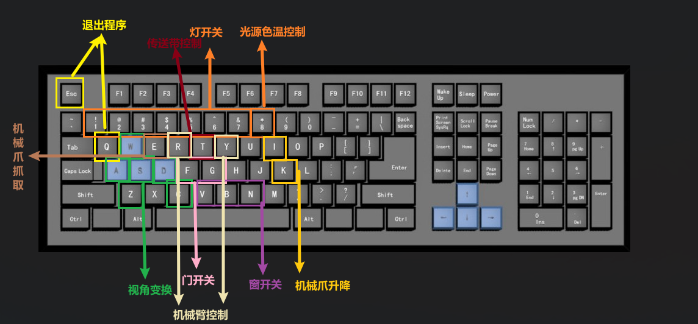

# CGProject

This is a project of 2021 CG course in ZJU.

> ***Group Member***
>
> Zhang Liyu, Xu Zikai, Wang Fangyikang, Zhang Shenke, Zhong Peipei, Bao Dezheng

## Keboard Operation



#### 视角变换

- `w` `s`：视角方向前后移动
- `a` `d`：视角方向在水平平面的投影的法线方向移动，即在同一个水平面里动
- `z` `c`：上下动

#### 机械臂操作

- `r`：控制机械臂1、2三个自由度；

#### 机械爪操作

- `e`：控制三个机械臂的机械爪抓取；

#### 传送带操作

- `t`：控制传送带转动（按一下动一下）;

#### 门窗控制

- `f` `g` ：控制两扇门的开与关;
- `v` `b` `n`：控制三扇窗开与关；

#### 光源控制

- `1` `2` `3` `4` `5` `6` `7` : 分别控制0-7号光源的开与关（视觉效果为灯的开关）；
- `8`：控制光的色温循环变化；

## Todo List

#### Stage 1 Week7-Thur
- 类之间的绑定与数据创建：wfyk 
- 光源变换（位置、颜色）、纹理变换：bdz 
- 机械臂动画效果：zly
- 不要走出房间-碰撞检测：zsk
- 体素添加（多面棱柱、多面棱台）：zpp

>2021.12.23:
>
>均Check, zly部分还未合并。由于我们的键盘操作***暂时做成的***针对的是全局变量，因此将wfyk写的push进队列的机器臂、传送带等暂时变成全局变量。
>
>另外关于列表内应当是对象还是对象指针，已经交由wfyk决定。

#### Stage 2 Week8-Tues

- 搭建一个默认流水线：zpp
- 放置物体：xzk
- 储存-导入导出：xzk
- 截屏+保存：zly


## Update History

#### 2021/12/25 updated by xzk

1. 添加了鼠标选取的相关代码, 调整了参数, 其中启用选择模式后, 需要采用正视图视角选取物体, 否则鼠标选取的准确度很不准。选取结果有s_type标识选中的对象类型, s_id标识对象在vector中的下标。
2. 部分调整了main.cpp, 增加了函数的声明，略微规范了代码的写法，将list类转成了vector类方便random access 
3. 添加了鼠标放置的功能, 目前鼠标放置放置的是六棱柱, 效果为在鼠标指向位置放置一个六棱柱, 后续可以拓展(累了)
4. 添加了glm库 位于include目录下
5. 添加了model_view.h及model_view.cpp, 实现鼠标位置转化成世界坐标
6. 修改robot类, 修复bug
7. 修改了shape类, 保证类下的globalX,globalY, globalZ三个坐标与世界坐标相等


#### 2021/12/28 by ZhongPeipei

##### 1，整理了shape类

+ 增加了draw函数里面增加了:

```c++
glScalef(this->scaleX, this->scaleY, this->scaleZ);
glRotatef(this->rotateX, 1, 0, 0);
glRotatef(this->rotateY, 0, 1, 0);
glRotatef(this->rotateZ, 0, 0, 1);
```

​	shape.h增加了scaleX, scaleY, scaleZ,

​	在main函数new一个shape的时候可以设置它的位置、大小、方向。

+ 在draw里面增加了`glTranslatef(0, 0.099, 0);	`，使得new一个shape的时候，globalY为0时b表示画在地板上。（地板应该有0.099的厚度）
+ 保证每个shape的globalY是底面的高度，便于判断是否在传送带上；globalY=0.2是在传送带上的条件之一


##### 2，修改了conveyor类

+ 增加了PositionZ
+ new一个时，PositionY=0时是画在地板上
+ 修改了传送带和物块绑定的函数
  + 每次调用传送带移动函数时，判断它上面有没有物体，有则带着物体一起走
  + 遍历shape vector看有没有shape在传送带上
  + 现在是当物体运动到传送带一端会停在那里，那么后面来的物体怎么处理？需要碰撞检测吗？（不然现在会重合在一起）
+ 目前是按下t之后是所有传送带都开始运动（是否需要分别控制？）
